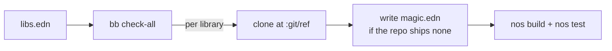

# magic-conformance

<div align="center">
    <a href="https://github.com/flybot-sg/magic-conformance/actions/workflows/conformance.yml"></a>
</div>

<br>

## Rational

[MAGIC](https://github.com/flybot-sg/magic) compiles Clojure to .NET so it can run in Unity through IL2CPP, Unity's AOT compiler. It ships Clojure 1.10, while stock ClojureCLR (David Miller's [`cljr`](https://github.com/clojure/clojure-clr)) is on 1.12. A library can pass its own CI on `cljr` and still break when MAGIC compiles it, either on a 1.11 or 1.12 function MAGIC does not have, or on something its AOT model rejects. Green on `cljr` does not mean green on MAGIC.

`magic` just needs a `magic.edn` config file at the root of the lib that `nostrand` can use to build and run the tests.

So this repo adds the magic.edn to a few OS libraries we commonly use at Flybot and test in its CI periodically if the build and run-test succeed.

## How it works

Everything lives in one file, [`libs.edn`](libs.edn), with one entry per library: where to fetch it, which git ref to pin, and an optional **`magic.edn`**, the small config `nos` (the MAGIC task runner) reads to build and test a project. Nothing is vendored. CI clones each entry fresh, writes that `magic.edn` (and a `deps-clr.edn` when the manifest supplies one) only when the library ships none of its own, then runs `nos build` and `nos test`.

CI is one job that walks the manifest (plus a small `rct` job testing the runner's pure helpers), so adding a library changes nothing else. The diagram below shows one run.



Add a line to the manifest, push, and CI tells you whether that library still runs under Unity.

## Layout

```
libs.edn                 the manifest: pins and inline magic config, the only file you edit
scripts/conformance.clj  the bb runner (clone, write magic.edn if absent, run nos)
.github/workflows/       the CI jobs: bb check-all and bb rct
```

## Add a library

One entry in `libs.edn`:

```clojure
my-org/my-lib
{:git/url "https://github.com/my-org/my-lib.git"
 :git/ref "master"                              ; a branch to track the tip, or a tag/sha to pin
 :magic   {:build {:exclude [my.lib.jvm-only]}} ; optional, omit when nos defaults suffice
 :tasks   [build test]}
```

Add the `:magic` map only when the library needs a build or test option, for instance keeping a JVM-only namespace out of the AOT compile. Leave it out when the `nos` defaults already work. Refer to [magic/docs](https://github.com/flybot-sg/magic/tree/main/docs) for how to write `magic.edn`

## Run it locally

You need `nos` on your path, or the [`ci-clj-clr`](https://github.com/flybot-sg/ci-clj-clr) image that ships it.

```bash
bb check fun-map     # one library, matched by coord, slug, or name
bb check-all         # every library, with a summary
bb rct               # test the pure helpers
bb clean             # drop the work/ clones
```

