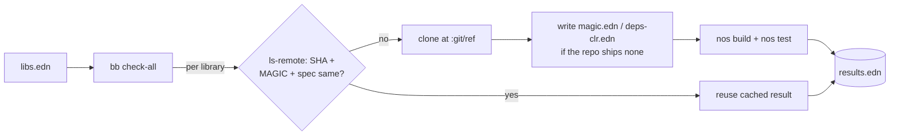

# magic-conformance

<div align="center">
    <a href="https://github.com/flybot-sg/magic-conformance/actions/workflows/conformance.yml"></a>
</div>

<br>

## Rational

[MAGIC](https://github.com/flybot-sg/magic) compiles Clojure to .NET so it can run in Unity through IL2CPP, Unity's AOT compiler. It ships Clojure 1.10, while stock ClojureCLR (David Miller's [`cljr`](https://github.com/clojure/clojure-clr)) is on 1.12. A library can pass its own CI on `cljr` and still break when MAGIC compiles it, either on a 1.11 or 1.12 function MAGIC does not have, or on something its AOT model rejects. Green on `cljr` does not mean green on MAGIC.

`magic` just needs a `magic.edn` config file at the root of the lib that `nostrand` can use to build and run the tests.

So this repo pairs a small `nos`-driven **runner** with an example [`libs.edn`](libs.edn): it clones each listed library, hands `nos` a `magic.edn`/`deps-clr.edn` when the library ships none, and runs its build and tests in CI. The libraries here are a green example — copy the manifest shape for your own set. The runner is a standalone babashka dependency (see [Reusing the runner](#reusing-the-runner)).

## How it works

Everything lives in one file, [`libs.edn`](libs.edn), with one entry per library: where to fetch it, which git ref to pin, and optional inline **`magic.edn`** / **`deps-clr.edn`** config `nos` (the MAGIC task runner) reads to build and test a project. Nothing is vendored. Per library, the runner first does a `git ls-remote` and **reuses the recorded result** when the ref's commit, the MAGIC version, and the config spec are all unchanged; otherwise it clones the entry fresh, writes the inline `magic.edn`/`deps-clr.edn` only when the library ships none of its own, and runs its `nos` tasks. Every result lands in [`results.edn`](results.edn), the committed snapshot that also seeds the next run's cache.

CI walks the manifest (plus a small `rct` job testing the runner's pure helpers), so adding a library changes nothing else. The diagram below shows one library in a run.



Add a line to the manifest, push, and CI tells you whether that library still runs under Unity.

## Layout

```
libs.edn                 the example manifest: pins and inline magic/deps-clr config
scripts/conformance.clj  the bb runner (ls-remote cache, clone, write config if absent, run nos)
deps.edn                 exposes the runner as a reusable babashka dependency
results.edn              committed snapshot of the last run; also the incremental-cache baseline
.github/workflows/       the CI jobs: incremental check-all, scheduled --force, and rct
```

## Add a library

One entry in `libs.edn`:

```clojure
my-org/my-lib
{:git/url "https://github.com/my-org/my-lib.git"
 :git/ref "master"                              ; a branch to track the tip, or a tag/sha to pin
 :magic   {:build {:exclude [my.lib.jvm-only]}} ; optional, omit when nos defaults suffice
 :tasks   [build test]}
```

Add the `:magic` map only when the library needs a build or test option, for instance keeping a JVM-only namespace out of the AOT compile. Leave it out when the `nos` defaults already work. Refer to [magic/docs](https://github.com/flybot-sg/magic/tree/main/docs) for how to write `magic.edn`

## Reusing the runner

`scripts/conformance.clj` is a standalone babashka script — `deps.edn` exposes it so another project can drive its own `libs.edn` (public or private URLs both work, since the runner just shells `git`) without copying the code:

```clojure
;; consumer bb.edn
{:deps  {io.github.flybot-sg/magic-conformance {:git/tag "v0.1.0" :git/sha "..."}}
 :tasks {:requires ([conformance :as c])
         check     {:task (c/check! (first *command-line-args*))}
         check-all {:task (c/check-all! (boolean (some #{"--force" "-f"} *command-line-args*)))}}}
```

An optional `conformance.edn` in the consumer overrides `:default-ref` (default `master`) and `:magic-version`. The consumer keeps its own `libs.edn` and `results.edn`; only the runner is shared.

## Incremental checks

A result is a pure function of **(commit SHA at the ref, MAGIC version, spec)**, where the spec is a digest of `:tasks` plus any inline `:magic` / `:deps-clr`. `check-all` records those in [`results.edn`](results.edn) and, per library, does a `git ls-remote` (no clone) and reuses the recorded result when SHA, MAGIC version, and spec all match — so only changed libraries re-run, which also catches regressions in previously-green libs. `--force` ignores the cache and re-runs everything; the weekly CI schedule does this to catch transitive-dep drift a per-lib SHA can't see.

`results.edn` is generated **locally** — run `bb check-all` and commit the result. CI only reads it as the cache baseline and re-runs changed libs; it never writes or publishes `results.edn`. `magic-version` is a constant in `scripts/conformance.clj`; bump it in the same commit that bumps the `ci-clj-clr` image tag so a new compiler re-runs every library.

## Run it locally

You need `nos` on your path, or the [`ci-clj-clr`](https://github.com/flybot-sg/ci-clj-clr) image that ships it.

```bash
bb check fun-map     # one library, matched by coord, slug, or name
bb check-all         # every library, incremental; writes results.edn
bb check-all --force # re-run all, ignore the cache
bb rct               # test the pure helpers
bb clean             # drop the work/ clones
```

