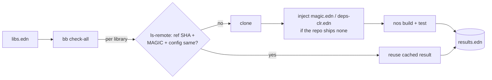

# magic-conformance

<div align="center">
    <a href="https://github.com/flybot-sg/magic-conformance/actions/workflows/conformance.yml"></a>
</div>

<br>

Does a Clojure library still build and test under [MAGIC](https://github.com/flybot-sg/magic) (Clojure→.NET for Unity/IL2CPP)? MAGIC ships Clojure 1.10, so passing on stock ClojureCLR ([`cljr`](https://github.com/clojure/clojure-clr), on 1.12) doesn't mean passing on MAGIC. This runner clones each library in a manifest and runs its `nos build`/`nos test` on the [`ci-clj-clr`](https://github.com/flybot-sg/ci-clj-clr) image, caching results so only changed libraries re-run.

`libs.edn` here is a small green example. `scripts/conformance.clj` is reusable — point it at your own manifest.

## Use it in your project

Add the runner to your `bb.edn`:

```clojure
{:deps {io.github.flybot-sg/magic-conformance {:git/tag "v0.1.0" :git/sha "..."}}  ; pin a tag/sha
 :tasks
 {:requires ([conformance :as c])
  check     {:task (c/check! (first *command-line-args*))}
  check-all {:task (c/check-all! (boolean (some #{"--force"} *command-line-args*)))}}}
```

Write a `libs.edn`, one entry per library:

```clojure
{my-org/my-lib
 {:git/url  "https://github.com/my-org/my-lib.git"  ; https or ssh
  :git/ref  "master"                                ; branch, tag, or sha
  :magic    {:build {:exclude [my.lib.jvm-only]}}   ; optional: written as magic.edn if the repo ships none
  :deps-clr {:paths ["src"]}                        ; optional: written as deps-clr.edn if the repo ships none
  :tasks    [build test]}}                          ; optional: auto-detected from magic.edn / dotnet.clj
```

Optional `conformance.edn` overrides the defaults:

```clojure
{:default-ref "master" :magic-version "v0.10.0"}
```

Run (needs `nos` on your PATH, or run inside the `ci-clj-clr` image):

```bash
bb check my-lib        # one library
bb check-all           # all, incremental (writes results.edn)
bb check-all --force   # ignore the cache
bb rct                 # test the runner's helpers
bb clean               # drop work/ clones
```

## How it works



A result is keyed on **(ref SHA, MAGIC version, config spec)**. `results.edn` is generated locally with `bb check-all` and committed; CI only reads it as the cache baseline. Bump `:magic-version` when the `ci-clj-clr` image tag bumps — it re-runs every library under the new compiler.

## Files

```
libs.edn                 the manifest (example: three green libs)
scripts/conformance.clj  the runner
deps.edn                 exposes the runner as a dependency
results.edn              committed run snapshot + cache baseline
```
